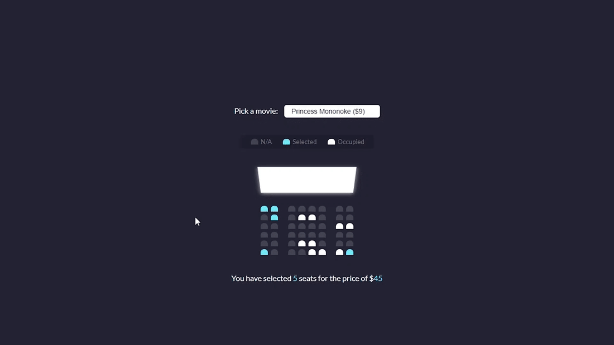

## Movie Seat Booking

Display movie choices and seats in a theater to select from in order to purchase tickets

## Project Specifications

- Display UI with movie select, screen, seats, legend & seat info
- User can select a movie/price
- User can select/deselect seats
- User can not select occupied seats
- Number of seats and price will update
- Save seats, movie and price to local storage so that UI is still populated on refresh

Design inspiration from [Dribbble](https://dribbble.com/shots/3628370-Movie-Seat-Booking)

## Demo

[Movie-Seats-Booking](https://gamejutsu-movie-seats.netlify.app)

## Authors

* **Kumar Vaibhav** - *Initial work* - [GameJutsu](https://github.com/gamejutsu)

## License

This project is licensed under the MIT License - see the [LICENSE.md](LICENSE.md) file for details
